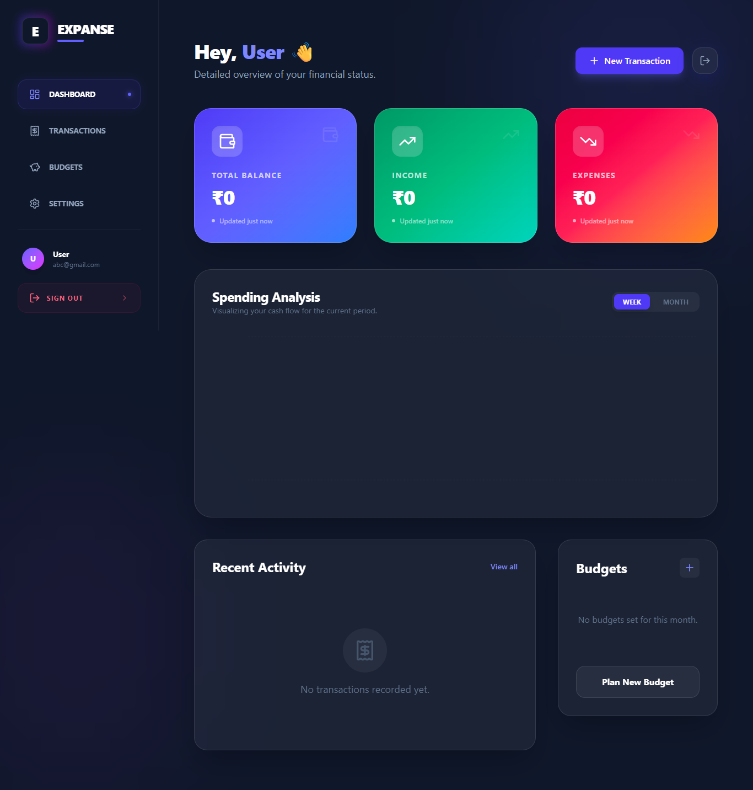
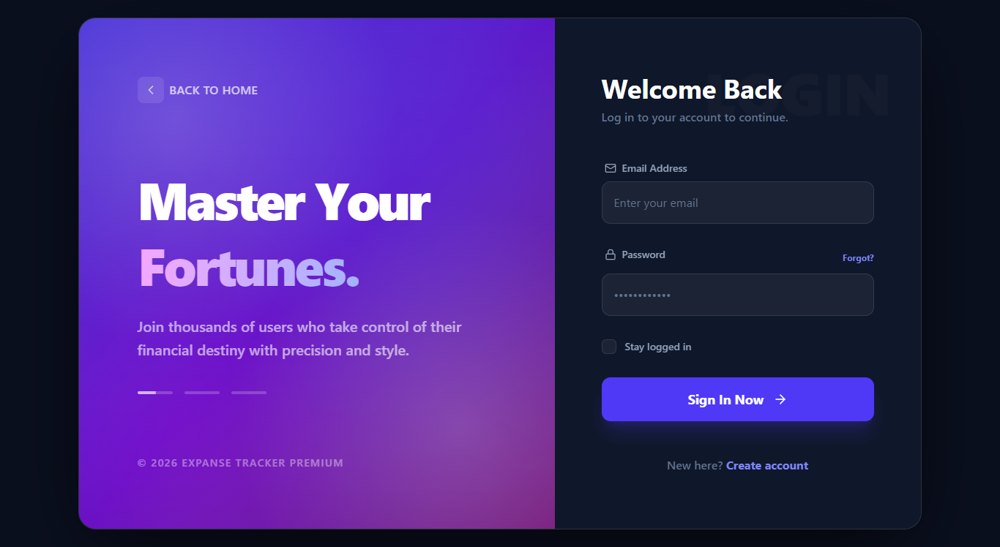
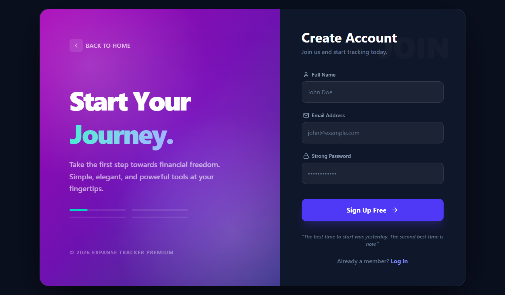

# 💎 Expanse Tracker Premium
> **Full-Stack Enterprise Financial Dashboard | Spring Boot 3 & React 19**



<div align="center">
  
  
</div>


---

## 🔥 Professional Highlights
- **Architecture**: Domain-driven design with clean separation of concerns.
- **Security**: Stateless JWT Authentication with Refresh Token rotation.
- **Performance**: Redis-based caching layer for high-frequency operations.
- **Design**: Premium Glassmorphism UI using Tailwind 4 Utility-first CSS.
- **Quality**: Automated MapStruct mappings and Global Exception Handling.

---

## 🚀 Quick Start Guide

Getting the entire platform up and running takes less than 2 minutes.

### 1. Simple One-Command Setup
Ensure you have **Docker** installed, then run:
```bash
docker-compose up -d --build
```

### 2. Access the Application
| Service | URL |
|---------|-----|
| **Frontend UI** | [http://localhost:5173](http://localhost:5173) |
| **Backend API** | [http://localhost:8080](http://localhost:8080) |
| **Swagger UI** | [http://localhost:8080/swagger-ui.html](http://localhost:8080/swagger-ui.html) |

---

## ✨ Features

- **🔐 Secure Auth**: Robust JWT-based authentication (Login/Register) with secure token handling.
- **📊 Real-time Dashboard**: Beautiful data visualization of your income, expenses, and total balance.
- **🎯 Smart Budgets**: Set category-wise limits and get visual warnings when approaching them.
- **💸 Transaction Flow**: Effortlessly track and categorize every penny you spend or earn.
- **📄 PDF Exports**: Generate professional monthly financial summaries instantly.
- **✨ Premium UI**: Modern glassmorphism design with fluid animations and responsive layouts.

---

## 🛠️ Technology Stack

| Domain | Technologies |
|--------|--------------|
| **Frontend** | React 19, Vite, Tailwind CSS 4, Framer Motion, Lucide Icons |
| **Backend** | Java 21, Spring Boot 3.2, Spring Security, MapStruct |
| **Storage** | PostgreSQL 15, Redis (Caching) |
| **Reports** | iText 7 (PDF Generation) |
| **DevOps** | Docker, Docker Compose |

---

## 📂 Project Structure

```text
├── 📂 backend/              # Spring Boot API
│   ├── 📂 src/              # Java & Resources
│   ├── 📄 pom.xml           # Maven Dependencies
│   └── 🐳 Dockerfile        # Backend Containerization
│
├── 📂 frontend/             # React Application
│   ├── 📂 src/              # Components, Pages, Hooks
│   ├── 🎨 index.css         # Tailwind 4 Design System
│   └── 🐳 Dockerfile        # Frontend Containerization
│
├── 📄 docker-compose.yml    # Multi-container Orchestration
└── 📄 README.md             # Project Documentation
```

---

## ⚙️ Configuration

The following environment variables can be configured in your `.env` or `docker-compose.yml`:

| Variable | Description | Default |
|----------|-------------|---------|
| `DB_HOST` | PostgreSQL Host | `db` |
| `DB_NAME` | Database Name | `expense_tracker_db` |
| `REDIS_HOST` | Redis Host | `redis` |
| `JWT_SECRET` | Secret for Tokens | *(Random generated)* |
| `MAIL_USERNAME` | SMTP Username | - |

---

## 📖 Developer Guide

### Running Frontend Locally
```bash
cd frontend
npm install
npm run dev
```

### Running Backend Locally
```bash
cd backend
./mvnw spring-boot:run
```

---

## 🤝 Contribution
1. Fork the Project
2. Create your Feature Branch (`git checkout -b feature/AmazingFeature`)
3. Commit your Changes (`git commit -m 'Add AmazingFeature'`)
4. Push to the Branch (`git push origin feature/AmazingFeature`)
5. Open a Pull Request

---

<p align="center">
  Built with ❤️ for Financial Freedom.
</p>
